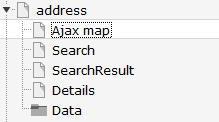

.. ==================================================
.. FOR YOUR INFORMATION
.. --------------------------------------------------
.. -*- coding: utf-8 -*- with BOM.

.. include:: ../Includes.txt

.. _admin-manual:

Administratormanual
====================

Target group: **Administrators**

Installation
^^^^^^^^^^^^
Import the  extension from TER (TYPO3 Extension Repository) like any other extension.
Create some pages as shown below.

On the  page 'Ajax Map' install plugin MyTTAddressMap (Map), on page 'Search' install plugin MyTTAddressMap (Searchform) , on
page 'Searchresult' install plugin MyTTAddressMap (Searchresult) and plugin MyTTAddressmap (Searchform) in the sidebar. Finally on page 'Details' install plugin MyTTAddressMap (SingleView).

On page 'address' or on your root page insert 'Typoscript Include static' (from extension) MyTTAddressmap (myttaddressmap).
With the constant editor insert the desired settings of the extension like storage Pid, Google map keys, Google maps options, your page ID's, 
jQuery options, path to templates etc. Make sure, you have loaded the jQuery on top of the page. 

You have to get 2 Google API keys. One as a Google Browser API key and one as a Google Server API key (for geocoding) from
here https://console.developers.google.com and insert them in the constants editor.
After fetching the keys you have to activate the Google Maps JavaScript API and the Google Maps Geocoding API.
When everything is working (geocoding and map display) you can restrict the browser key with http url and the
server key with ip address of the webserver to prevent illegal use of the keys.

The data of tt_address and sys_categories is stored in page Data. Insert in the constant editor
the correct "Default storage PID" of the tt_address records.

Then insert at least one sys_category in the page Data. Now insert some tt_address data records and
assign them to sys_categories.

The country selector in template AjaxSearch.html use 2 chars for the country. If you have inserted full country names in your tt_address records you have
to change the select options in template AjaxSearch.html.

To use your own mapIcons insert your mapIcons into the directory fileadmin/ext/myttaddressmap/Resources/Public/Icons.
Insert in this directory your icons which then can be selected in your tt_address data records.

When everything is ok - go test it...

Inserting data
^^^^^^^^^^^^^^
In TYPO3 list module select page Data. First insert some sys_categories.
Then you can insert some tt_address data records. You have not to insert the coordinates. The plugin
fetches the coordinates automatically from Google. To get this working, it is important that you insert
correct address data (city and country at least). If you don't insert some icon, the extension uses a default icon for the 
POI's.

When everything is done you can start a search in frontend.

Reference
^^^^^^^^^

.. _plugin-tx-myttaddressmap:

plugin.tx\_myttaddressmap.view
^^^^^^^^^^^^^^^^^^^^^^^^^^^^^^

templateRootPath
""""""""""""""""

.. container:: table-row

   Property
         templateRootPath

   Data type
         string

   Description
         path to templates

   Default
         EXT:myttaddressmap/Resources/Private/Templates/

partialRootPath
""""""""""""""""

.. container:: table-row

   Property
         partialRootPath

   Data type
         string

   Description
         path to partials

   Default
         EXT:myttaddressmap/Resources/Private/Partials/
     
layoutRootPath
""""""""""""""

.. container:: table-row

   Property
         layoutRootPath

   Data type
         string

   Description
         path to layouts

   Default
         EXT:myttaddressmap/Resources/Private/Layouts/

     

plugin.tx\_myttaddressmap.settings
^^^^^^^^^^^^^^^^^^^^^^^^^^^^^^^^^^

.. _googleBrowserApiKey:

googleBrowserApiKey
"""""""""""""""""""

.. container:: table-row

   Property
         Google Browser API Key

   Data type
         string

   Description
         Google Browser API key, get one here https://console.developers.google.com

   Default
         -

.. _googleServerApiKey:

googleServerApiKey
"""""""""""""""""""

.. container:: table-row

   Property
         Google Server API Key

   Data type
         string

   Description
         The Google Server API key is used for geocoding, get one here https://console.developers.google.com

   Default
         -

resultPageId
""""""""""""

.. container:: table-row

   Property
        resultPageId

   Data type
         int

   Description
         Id of the result page, especially when used with ajax search or search form insert the plugin search on the page with this id. Do not use the plugin singleView on this page.

   Default
        -

detailsPageId
"""""""""""""

.. container:: table-row

   Property
        detailsPageId

   Data type
         int

   Description
         Id of the details page

   Default
        -

singleViewUid
"""""""""""""

.. container:: table-row

   Property
        singleViewUid

   Data type
        int

   Description
        Uid of the loaction record to be shown with the single view plugin.

   Default
        1

resultLimit
"""""""""""

.. container:: table-row

   Property
        resultLimit

   Data type
        int

   Description
        Limit the result to n records

   Default
        300

initialMapCoordinates
"""""""""""""""""""""

.. container:: table-row

   Property
        initialMapCoordintes

   Data type
         string

   Description
         Initial map coordinates [latitude,longitude]

   Default
        48,8

.. _enableTrafficLayer:

enableTrafficLayer
""""""""""""""""""

.. container:: table-row

   Property
         enableTrafficLayer

   Data type
         boolean

   Description
         Enables the traffic layer in the map

   Default
         -

.. _enableBicylingLayer:

enableBicyclingLayer
""""""""""""""""""""

.. container:: table-row

   Property
         enableBicyclingLayer

   Data type
         boolean

   Description
         Enables the bicycling layer in the map. Only traffic- or bicycling-layer are shown, not both together!

   Default
        -

.. _enableMarkerClusterer:

enableMarkerClusterer
"""""""""""""""""""""

.. container:: table-row

   Property
         enableMarkerClusterer

   Data type
         boolean

   Description
         Enables the clustering of markers

   Default
         -

.. _mapTheme:

mapTheme
""""""""

.. container:: table-row

   Property
         mapTheme

   Data type
         string

   Description
         Json file with Google map theme. Example: fileadmin/includes/ext/myttaddressmap/MapTheme/Retro.json. You can create your own map theme here: https://mapstyle.withgoogle.com/. Use with care - if your file is not a valid Google map theme it will break the javascript!

   Default
        -

.. _defaultIcon:

defaultIcon
"""""""""""

.. container:: table-row

   Property
         defaultIcon

   Data type
         string

   Description
         Default map icon, shown when no map icon is given

   Default
        /typo3conf/ext/myttaddressmap/Resources/Public/Icons/pointerBlue.png

defaultLanguageUid
""""""""""""""""""

.. container:: table-row

   Property
        defaultLanguageUid

   Data type
         string

   Description
         Use 0 in multi language sites to override selected language in Frontend and if tt_adress record are not localized. Leave it blank to use TYPO3 localization.

   Default
        

Events
^^^^^^

Existing events in LocationController.php to modify location(s) by third party extension.

`WSR/Myttaddressmap/Event/SingleViewEvent`

`WSR/Myttaddressmap/Event/SearchViewEvent`

Route enhancer example
^^^^^^^^^^^^^^^^^^^^^^

This works only with the Searchform and not with the AjaxSearch!
Use something like this in sites/.../config.yaml. 

Known problems
^^^^^^^^^^^^^^

No images are shown - if you use the fluid <f:image ...> tag in the templates, make sure you have set a one level Slug.

No map loaded - ReferenceError: $ is not defined
Make sure, you have loaded the jQuery on top of the page. This can be done with the constant editor of TYPO3 and the myttaddressmap category (plugin.tx_myttaddressmap.view.includejQueryCore).

If something goes wrong with geocoding check the answers from Google with tools like firebug and check
the answers you get from from google in console or networking.

No map POIs shown (unterminated string) - make sure you have no newlines in the fields which are shown in the
infoWindows (address, city,...) because this can break the javascript.

AjaxSearch
^^^^^^^^^^

Set the Default Storage Pid of the locations in the constant editor.

FAQ
^^^

*Custom templates and files*

You can use your own template and CSS file or other jQuery library - just go to the TYPO3 constants editor and change
the values for your needs.
