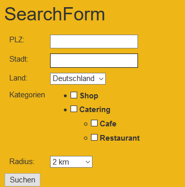
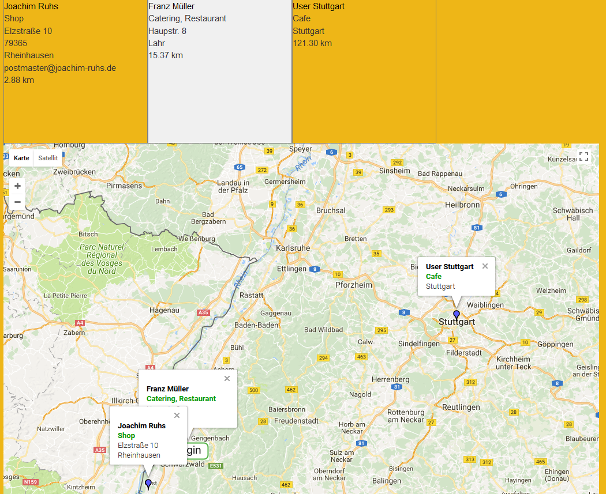
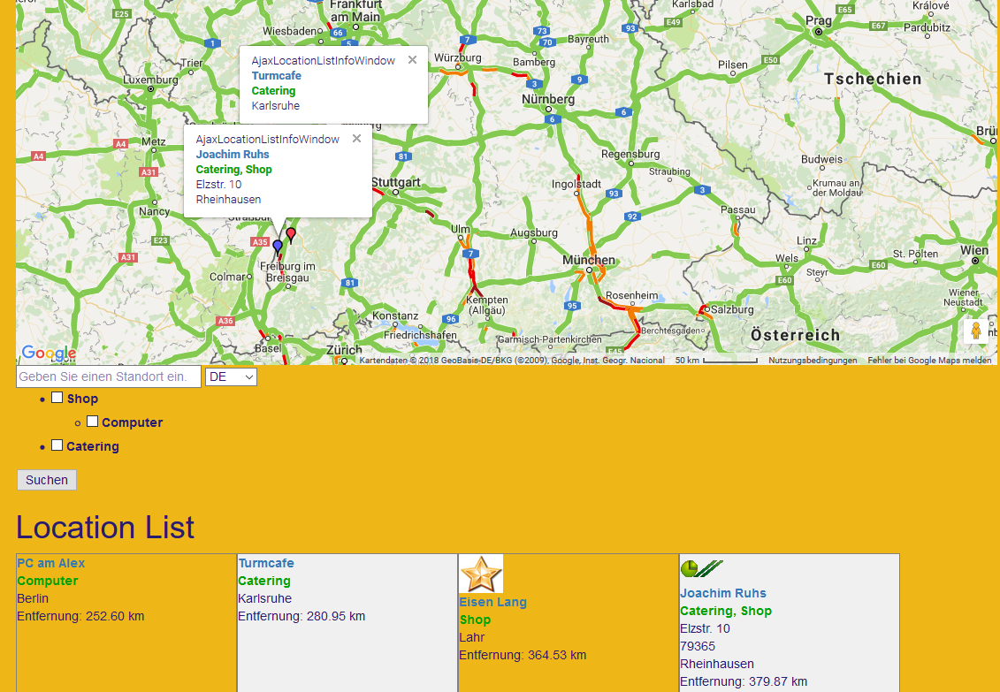
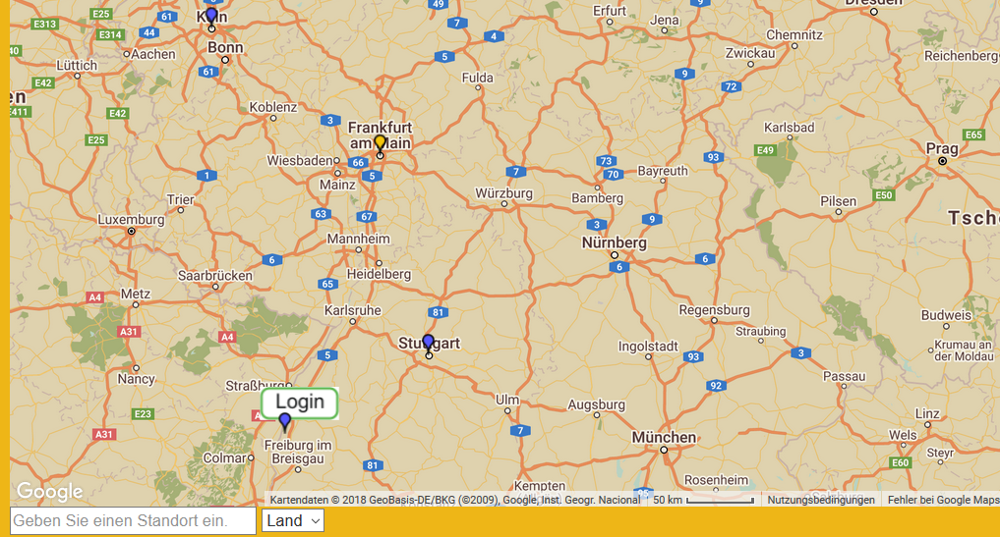

.. ==================================================
.. FOR YOUR INFORMATION
.. --------------------------------------------------
.. -*- coding: utf-8 -*- with BOM.

.. include:: ../Includes.txt

What does it do?
================

The extension enables you to show tt_address locations in responsive Google maps.
You can do a radial search for locations and display them in a list and a responsive Google map with Google infoWindows. 
The extension is based on multiple plugins. This way you can use more than one plugin of the extension on the same page. 
A single view of the location is implemented too, this can be used to display just a Google map without doing a search when the locationUid is given
in the constant editor of TYPO3. 

Within the Ajaxsearch you can show all address-POIs of a country if you leave the address field empty and select the country of your choice.

What's new?
^^^^^^^^^^^
<<<<<<< HEAD
**New mapIcon handling**
=======
>>>>>>> parent of 8cbe386... Update Index.rst
The directories fileadmin/ext/myttaddressmap/Resources/Public/Icons are created if they don't exist. Insert here your mapIcons. 
These icons can then be selected in the tt_address record (Mapicon).

Screenshots
^^^^^^^^^^^

**Search form** 

**Search result with Google map** 

**MyTTAddressMap (Map) result** 

**MyTTAddressMap (Map) result with Retro theme** 

    

